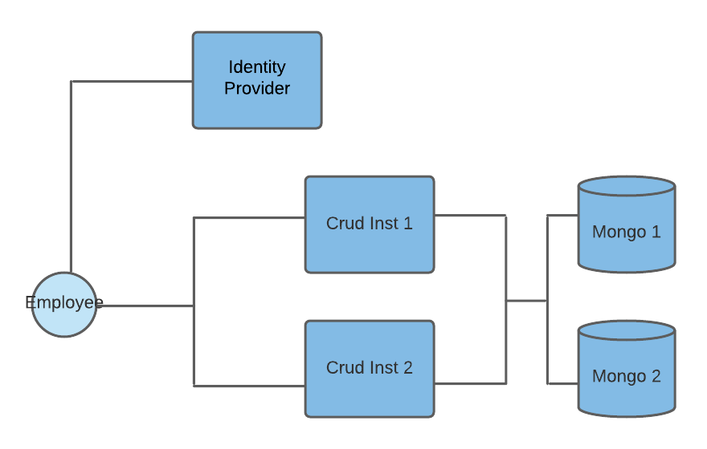

# Spring Crud App

Project shows example of Spring Boot's usage to create simple crud app for fictuous company AwesomeCORP. Starters and tools used:

* Spring Mvc
* Spring Boot Testing
* Spring Maven plugin for building images
* Spring Data Mongo
* Auth0 java-jwt
* Spring Security
* docker and docker-compose


### Story

AwesomeCORP despite it's name is a small company with hierarchical structure. Hierarchy tree has three levels: there is CEO at the top, level 2 are managers for HR and IT departments and each department can have unlimited number of workers.

For each fulfilled action there must be an approval chain. The app is the engine enforcing all the rules of the workflow.

#### Actions

**HIRE** - causes randomly generated person to be attached to hiararchy tree either to HR or IT department

**FIRE** - removes person from hierarchy tree, in case of manager or CEO, new person is promoted to
her position (with custom ranking rules)

**PRAISE** - number of praises affects promotion

**GIVE_RAISE** - another way to reward employee is to give him raise. All raises are by 10%.


#### Approval rules

The approval chain starts by some person *initiating* a *case*. Not everyone can initate every action though:

|Role|Can initiate|
|----|------------|
|IT  | HIRE, PRAISE|
|HR  | HIRE, PRAISE|
|IT_MANAGER|HIRE, PRAISE, GIVE_RAISE, FIRE|
|HR_MANAGER|HIRE, PRAISE, GIVE_RAISE, FIRE|
|CEO|HIRE, PRAISE, GIVE_RAISE, FIRE|


then in every step if person is not able to fullfill the request she promotes a case up in the hierarchy by appending it to her boss' mailbox.

|Fullfills|Action|
|---------|------|
|CEO      |FIRE, HIRE|
|HR_MANAGER| PRAISE, GIVE_RAISE|
|IT_MANAGER| PRAISE, GIVE_RAISE|
|HR| - |
|IT| - |

After approval from the fullfilling role the request is automatically executed by system.


### Design considerations

Following diagram shows architecture:




Crud instances are under most load and they need
to be scaled. Because managing sessions with multiple (loadbalanced) instances is not easy, I made
crud stateless driven by JWT token saved in cookie.

Login is much lighter and probably doesn't need to be scaled. Also it doesn't fit into the rest of
the logic so I have split it out to separate service.

Additionally Mongo has requirement that for db transactions to work cluster with replication must to be set up.


### Building and running

Requirements to run the app are Maven 3, Java 17 docker and docker-compose.
After download you have to setup paths in build.sh script. From that point if you have linux it should work.

First build images from root directory:

```
mvn package
```

And then run docker-compose
```
docker-compose -f app.yml up
```

Don't forget to clean up stale containers after stopping
```
docker-compose -f app.yml rm
```

### Default User Accounts

|Name|Username|Password|
|----|--------|--------|
|Greg|a@corp.com|a|
|Adam|b@corp.com|b|
|Meg|c@corp.com|c|
|James|d@corp.com|d|
|Monica|e@corp.com|e|
|Frank|f@corp.com|f|
|Frank|g@corp.com|g|
